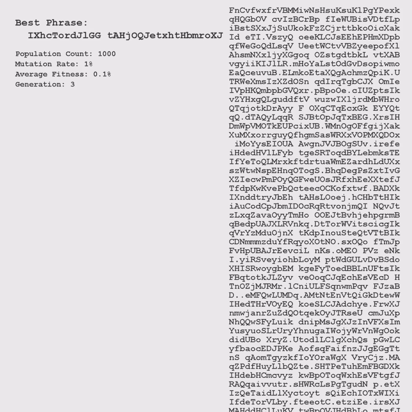

# shakespeare-monkeys-genetic-algorithm

The [infinite monkey theorem](https://en.wikipedia.org/wiki/Infinite_monkey_theorem) states:

> A monkey hitting keys at random on a typewriter keyboard for an infinite amount of time will almost surely type any given text, such as the complete works of William Shakespeare.

This program simulates this but under a few extra conditions:

1. There are numerous "monkeys" rather than one
2. The monkeys are replaced by a new population of monkeys after each typing attempt
3. The new population of monkeys are created by breeding of the previous generation of monkeys
4. The monkeys that performed better are more likely to be parents for the next generation
5. The offspring monkeys are mutated slightly after birth

Essentially, the program is an implementation of a genetic algorithm where the monkeys are represented by the string of characters they type. At first, the monkeys type gibberish. Then a fitness is calculated based on how well they perform:

  

The fitness is cubed to amplify the differences of those that performed well and those that didn't. Then from this generation we randomly pick monkeys to be parents based on their fitness. So the higher the fitness the higher the chances of being selected. The pairs of parents picked then create a new offspring monkey. This is done in two steps:

1. Iterate through each character of the parent's text and create a new text by randomly picking from one of the parents
2. Then we iterate through each character of this newly created text and randomly change it based on the mutation rate

## Demos

Population: 200 monkeys\
Mutation Rate: 1%\
Target Sentence: To be or not to be

---

Population: 45 monkeys\
Mutation Rate: 4%\
Target Sentence: To be or not to be

---

Population: 1000 monkeys\
Mutation Rate: 1%\
Target Sentence: To be or not to be

